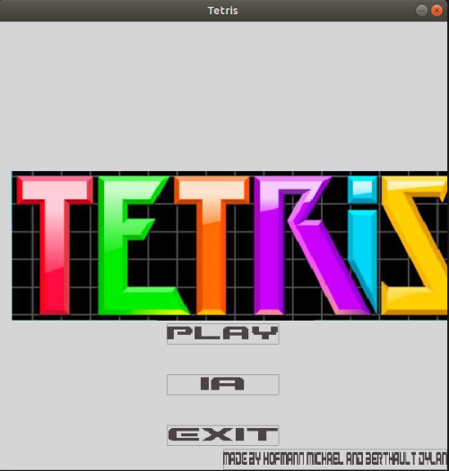

# Tetris Game
By [Michael Hofmann](https://github.com/Mis0ko), [Dylan Berthault](https://github.com/Quwazar)  
Last update : 04/17/2021.

  
 

## pre-requisites

`sudo apt-get install libsdl2-dev`  
`sudo apt-get install libsdl-mixer1.2`  
`sudo apt-get install libsdl2-ttf-dev`  
`sudo apt-get install libsdl2-image-2.0-0`  
`sudo apt-get install libsdl2-mixer-dev`  
`sudo apt-get install libsdl2-image-dev`  

## Launch the Game:

`make`  
`./tetris` 
